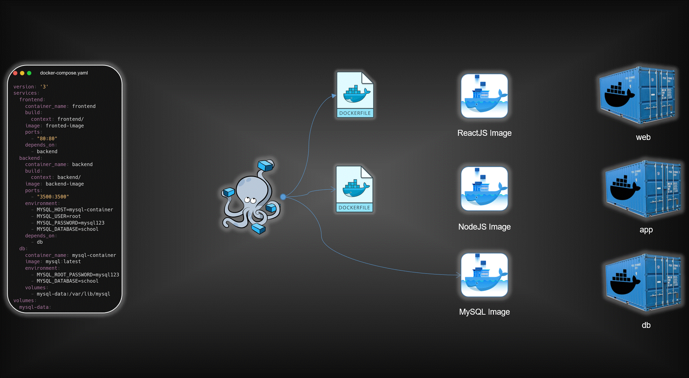

# 3-Tier Kubernetes Application

<p align="center">
  
</p>

<p align="center">
  Production-ready 3-tier application with React frontend, Node.js backend, and MySQL database. Built for Kubernetes deployment and DevOps learning.
</p>

## Table of Contents

- [Overview](#overview)
- [Purpose](#purpose)
- [Architecture](#architecture)
- [Tech Stack](#tech-stack)
- [Project Structure](#project-structure)
- [Local Development](#local-development)
- [Docker Containerization](#docker-containerization)
- [Kubernetes Deployment](#kubernetes-deployment)
- [Troubleshooting](#troubleshooting)
- [Roadmap](#roadmap)

## Overview

[](https://github.com/yourusername/3tier-k8s-app)
[](#kubernetes-deployment)
[](#docker-containerization)
[](http://makeapullrequest.com)

This project demonstrates modern application deployment patterns using Kubernetes orchestration. It features a complete 3-tier architecture with persistent storage, service mesh communication, and production-ready configurations for learning enterprise-grade container orchestration.

## Purpose

- Demonstrate real-world Kubernetes deployment patterns for multi-tier applications
- Provide hands-on experience with container orchestration and service discovery
- Showcase DevOps best practices including infrastructure as code and automated deployments
- Serve as foundation for CI/CD pipeline implementation and GitOps workflows
- Bridge the gap between local development and production Kubernetes environments

## Architecture

```
┌─────────────────┐    ┌─────────────────┐    ┌─────────────────┐
│   Frontend      │    │    Backend      │    │   Database      │
│   React + Nginx │◄──►│   Node.js       │◄──►│    MySQL        │
│   Port: 80      │    │   Port: 3500    │    │   Port: 3306    │
│   NodePort      │    │  LoadBalancer   │    │   ClusterIP     │
└─────────────────┘    └─────────────────┘    └─────────────────┘
```

**Communication Flow:**
- Frontend → Backend: HTTP API calls via Kubernetes service discovery
- Backend → Database: MySQL connection using internal service names
- External Access: Port forwarding for development, Ingress for production

## Tech Stack

**Frontend:**
- React.js 18+ with modern hooks and functional components
- Nginx 1.25+ for production serving and SPA routing
- Responsive CSS design with cross-device compatibility

**Backend:**
- Node.js 16+ with Express.js framework
- MySQL2 driver for optimized database connectivity
- RESTful API design with comprehensive error handling

**Database:**
- MySQL 8.0 with InnoDB storage engine
- Persistent volume storage for data durability
- Automated schema initialization and sample data

**Infrastructure:**
- Docker multi-stage builds for minimal image sizes
- Kubernetes-native deployment with health checks
- ConfigMaps and Secrets for configuration management

## Project Structure

```
3tier-k8s-app/
├── frontend/
│   ├── src/
│   │   ├── components/
│   │   ├── pages/
│   │   └── App.js
│   ├── public/
│   ├── package.json
│   ├── Dockerfile
│   └── nginx.conf                # SPA routing configuration
├── backend/
│   ├── server.js                 # Express server entry point
│   ├── routes/
│   ├── config/
│   ├── package.json
│   └── Dockerfile
├── k8s-manifests/
│   ├── namespace.yaml
│   ├── secrets.yaml              # Database credentials
│   ├── configmaps.yaml           # Application configuration
│   ├── mysql/
│   │   ├── pv-pvc.yaml          # Persistent storage
│   │   ├── deployment.yaml       # Database deployment
│   │   └── service.yaml          # Internal service
│   ├── backend/
│   │   ├── deployment.yaml       # API server deployment
│   │   └── service.yaml          # Backend service
│   └── frontend/
│       ├── deployment.yaml       # Web server deployment
│       └── service.yaml          # Frontend service
└── docs/
    ├── local-setup.md
    ├── docker-guide.md
    └── kubernetes-troubleshooting.md
```

## Local Development

### Prerequisites

- Node.js 16+ and npm package manager
- Docker Desktop with Kubernetes enabled
- kubectl CLI tool configured
- Git for version control

### Installation Steps

1. **Clone Repository:**
   ```bash
   git clone https://github.com/yourusername/3tier-k8s-app.git
   cd 3tier-k8s-app
   ```

2. **Backend Setup:**
   ```bash
   cd backend
   npm install
   node server.js  # Development server on http://localhost:3500
   ```

3. **Frontend Setup:**
   ```bash
   cd frontend
   npm install
   npm start  # Development server on http://localhost:3000
   ```

4. **Database Setup:**
   ```bash
   docker run --name mysql-local \
     -e MYSQL_ROOT_PASSWORD=rootpassword123 \
     -e MYSQL_DATABASE=school \
     -e MYSQL_USER=school_user \
     -e MYSQL_PASSWORD=password123 \
     -p 3306:3306 -d mysql:8.0
   ```

### How to Run

**Development Environment:**
```bash
npm run dev:backend    # Starts backend with nodemon
npm run dev:frontend   # Starts React development server
npm run dev:database   # Initializes local MySQL container
```

**Output:**
- Backend API available at http://localhost:3500
- Frontend application at http://localhost:3000
- Database accessible on localhost:3306
- Hot reload enabled for development


## Docker Containerization

### Build Process

**Multi-stage Frontend Build:**
```bash
cd frontend
docker build -t yourusername/3tier-frontend:latest .
docker push yourusername/3tier-frontend:latest
```

**Backend Containerization:**
```bash
cd backend
docker build -t yourusername/3tier-backend:latest .
docker push yourusername/3tier-backend:latest
```

### Container Testing

**Complete Stack Verification:**
```bash
# Database container
docker run --name mysql-container \
  -e MYSQL_ROOT_PASSWORD=rootpassword123 \
  -e MYSQL_DATABASE=school \
  -e MYSQL_USER=school_user \
  -e MYSQL_PASSWORD=password123 \
  -p 3306:3306 -d mysql:8.0

# Backend container
docker run --name backend-container \
  -e DB_HOST=host.docker.internal \
  -e DB_USER=school_user \
  -e DB_PASSWORD=password123 \
  -e MYSQL_DATABASE=school \
  -p 3500:3500 -d yourusername/3tier-backend:latest

# Frontend container
docker run --name frontend-container \
  -p 3000:80 -d yourusername/3tier-frontend:latest
```

## Kubernetes Deployment

### Cluster Prerequisites

- Kubernetes cluster (minikube, Docker Desktop, or cloud provider)
- kubectl configured with cluster access
- Sufficient cluster resources (2 CPU, 4GB RAM minimum)

### Deployment Steps

1. **Cluster Initialization:**
   ```bash
   # Start minikube cluster
   minikube start --driver=docker --memory=4096 --cpus=2
   
   # Verify cluster status
   kubectl cluster-info
   ```

2. **Application Deployment:**
   ```bash
   # Create dedicated namespace
   kubectl create namespace school-app
   
   # Deploy all components
   kubectl apply -f k8s-manifests/ -n school-app
   
   # Monitor deployment progress
   kubectl get pods -n school-app -w
   ```

3. **Service Verification:**
   ```bash
   # Check all resources
   kubectl get all -n school-app
   
   # Verify persistent volume claims
   kubectl get pvc -n school-app
   ```

### Access Application

**Port Forwarding for Development:**
```bash
# Frontend access
kubectl port-forward service/frontend-service 3000:80 -n school-app

# Backend API access
kubectl port-forward service/backend-service 3500:3500 -n school-app

# Direct database access (debugging only)
kubectl port-forward service/mysql-service 3306:3306 -n school-app
```

**Application URLs:**
- Frontend: http://localhost:3000
- Backend API: http://localhost:3500
- Student Management: http://localhost:3000/student
- Teacher Management: http://localhost:3000/teacher

## Troubleshooting

### Common Deployment Issues

**Pod Status Problems:**
```bash
# Check pod events and status
kubectl describe pod <pod-name> -n school-app

# View detailed logs
kubectl logs <pod-name> -n school-app --previous

# Check resource constraints
kubectl top nodes
kubectl top pods -n school-app
```

**Database Connectivity Issues:**
```bash
# Test service discovery
kubectl exec -it deployment/backend-deployment -n school-app -- nslookup mysql-service

# Verify database initialization
kubectl exec -it deployment/mysql-deployment -n school-app -- mysql -uroot -prootpassword123 -e "SHOW DATABASES;"

# Check persistent volume status
kubectl describe pv -n school-app
```

**Application Access Problems:**
```bash
# Verify service endpoints
kubectl get endpoints -n school-app

# Test port forwarding connectivity
kubectl port-forward --address 0.0.0.0 service/frontend-service 3000:80 -n school-app

# Check ingress configuration (if applicable)
kubectl describe ingress -n school-app
```

### Debug Commands

**Resource Inspection:**
```bash
# Comprehensive cluster state
kubectl get all --all-namespaces

# Resource utilization
kubectl describe nodes

# Event monitoring
kubectl get events -n school-app --sort-by=.metadata.creationTimestamp
```

**Container Debugging:**
```bash
# Execute into running containers
kubectl exec -it <pod-name> -n school-app -- /bin/bash

# Port connectivity testing
kubectl exec -it <pod-name> -n school-app -- nc -zv <service-name> <port>

# DNS resolution verification
kubectl exec -it <pod-name> -n school-app -- nslookup <service-name>
```

## Roadmap

### Phase 1: Foundation ✅
- [x] Multi-tier application architecture
- [x] Docker containerization with multi-stage builds
- [x] Basic Kubernetes deployment manifests
- [x] Local development environment setup

### Phase 2: CI/CD Integration (In Progress)
- [ ] GitLab CI pipeline configuration
- [ ] Automated testing and quality gates
- [ ] Container security scanning
- [ ] Multi-environment deployment automation

### Phase 3: GitOps Implementation
- [ ] ArgoCD installation and configuration
- [ ] Git-based deployment workflows
- [ ] Automated synchronization and rollbacks
- [ ] Environment-specific configurations

### Phase 4: Production Readiness
- [ ] Helm charts for templated deployments
- [ ] Ingress controller with TLS termination
- [ ] Horizontal Pod Autoscaling implementation
- [ ] Resource monitoring with Prometheus and Grafana

### Phase 5: Cloud Native Features
- [ ] Multi-cloud deployment (AWS EKS, Azure AKS, GCP GKE)
- [ ] Service mesh implementation with Istio
- [ ] Backup and disaster recovery procedures
- [ ] Performance optimization and load testing

### Step-by-Step Cloud Setup (Coming Soon)

If you'd like to advance with this project, feel free to clone it, enhance the implementation further, and share your improvements – the community would benefit from seeing how you extend this Kubernetes deployment foundation!
